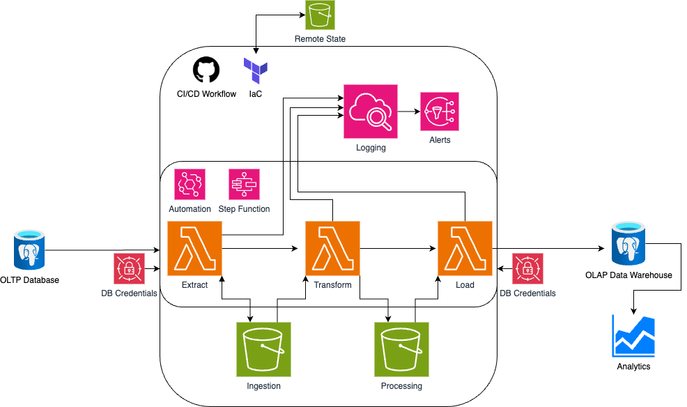

# *TerrificTotes* Data platform Project

## Introduction

ETL Data Platform deployed using Terraform, AWS, CI/CD through Github, Python and SQL. Data is regularly extracted from OLTP database, transformed into a star-schema format and loaded into an OLAP data warehouse. Processes are logged and alerts are triggered in the event of an error.

## Video Presentation

Please watch this presentation on the details of the project: https://www.youtube.com/watch?v=9ZxfqiAg6XI&t=463s

## Visual Diagram

## Technologies

**Testing**

PyTest for unit and integration testing

Bandit for security testing - e.g. SQL injection prevention

Pip-audit for testing package vulnerabilities

Coverage (PyTest-cov) to ensure thorough testing (95% achieved)

Postgres used to create test OLAP database

**Within functions**

Boto3 for interfacing with AWS
PG8000 for interacting with the databases
Pandas for manipulating data

**AWS infrastructure**

Lambda functions to run Python
S3 storage buckets to contain data and code
Cloudwatch to monitor logs
Secrets Manager to hold database credentials

**Deployment**

Terraform - Infrastructure as Code to implement the AWS environment
GitHub Actions - to enable Continuous Integration and Delivery

# The 'Extract, Transform, Load' process

**Extract**

The first AWS Lambda function reads an S3 ‘ingestion’ bucket to see what the most up-to-date data is
It then queries the Totesys database to collect any new data
If there is new data, it is converted to CSV format, written to the S3, and the filename is passed to the second Lambda

**Transform**

The second Lambda function looks at each file and matches it to a transformation process for each particular table
The star-schema format is a fact table for sales and dimension tables for locations, dates, departments, staff, designs and currency
E.g. If data for a new member of staff has been added, the department table is joined on so that the department name can be included, the columns are rearranged and the Staff Dimension table is written to the S3 ‘processing’ bucket in Parquet format
Details of the files written are passed on to the third Lambda

**Load**

The final Lambda function converts each file into a Pandas dataframe and inputs it to the Online Analytical Processing Data Warehouse

**Automation**

This process is automated with Eventbridge to run every 25 minutes to ensure all processes take place within a 30 minute window
StepFunction is used so that if no new data is found by the first Lambda function, the process concludes without triggering the other functions - this reduces the computational cost

**Continuous Integration and Deployment**

Tests were automated through GitHub Actions every time a pull request was made into the main branch
These ensured the code was secure, functional and formatted correctly before being integrated

## Developer Instructions

**Requirements**

- an OLTP database following 'totesys' schema with regular data insertion
- an OLAP database following 'totesys' schema
- Database credentials need to be stored in AWS Secrets Manager
- AWS account with IAM roles and permissions created
- AWS permissions for Github Actions setup and credentials stored in Github Secrets
- Terraform - https://developer.hashicorp.com/terraform/tutorials/aws-get-started/install-cli
- Postgres with 'postgres' user and 'postgres' password for DB tests - https://www.postgresql.org/download/

- **Running The Make File**

  - **make create-environment** - creates a virtual environment.
  - **make requirements** - downloads the relevant dependencies for the project.
  - **make dev-setup** - sets up dev requirements (*bandit, pip-audit, black*).
  - **make run-checks** - runs checks on the project code (*security test, black, unit tests, and coverage checks*)
    - Test database requires
  - **make layer-setup** - prepare the lambda layers.
  - **make clean** - clean up the lambda layer dependencies.
  - **make all** - run all of the commands.

## The Terraformers Team

This project was created by the Terraformers using Agile methods - standups, scrums and pair-programming

**The Team:**

[Andrew](https://github.com/andrewstride)

[Arthur](https://github.com/eganiard)

[Daniel](https://github.com/DanielSolomon7)

[Liam](https://github.com/studiobigli)

[Shahanaz](https://github.com/Shahanaz012)